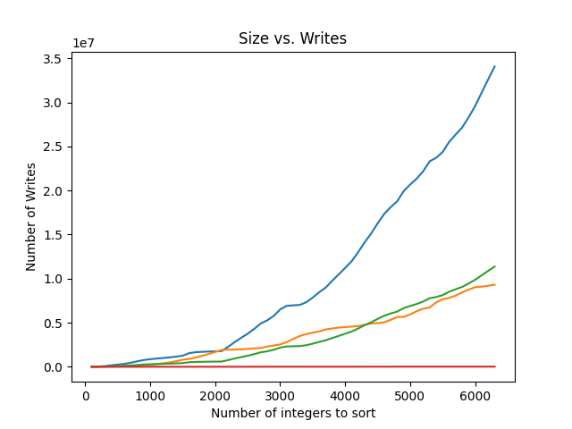
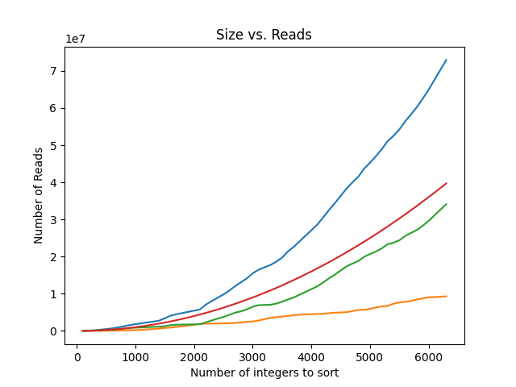
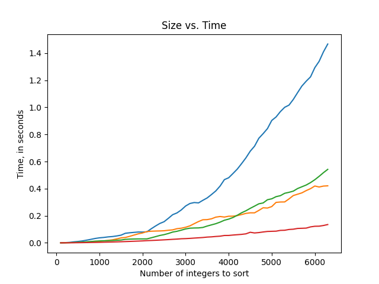

# Project 4 Report

Answer the following prompts directly in this file:
* Information about your dataset (you will be assigned a different grader for this project).  
My dataset shows death rates due to suicide from 1950-2018. It is also qualified based on many factors such as sex and age. However, the data is qualified is denoted in multiple different fields for each row. Each field that qualifies the data with a string is also represented with a number in the next cell.
* Analyze the data. Graph the number of reads and writes for each sorting algorithm and look at how the number of reads and writes grows when the size of the data set grows. Compare and contrast the different sorting algorithms and draw conclusions about which sorting algorithms are more efficient. Discuss complexities and their effects.

With the writes we can easily see that bubble sort grows the fastest. This makes sense because it is constantly switching values. With bubble sort the number of writes increases roughly 4.5 fold when the size of the vector goes from 3000 to 6000. When looking at the vector size doubling from 500 to 1000 it increases about 3.6 fold. So as the size of your inputs gets bigger the rate of change increases. increasing rate of change is quadratic complexity, which lines up nicely with the complexity theory that shows bubble sort having quadradic time complexity. Because bubble sort is very inefficient it has many more writes than any other algorithm. Heap sort both has significantly fewer writes than bubble sort and grows almost linearly. This is good to see because the in class anylisis that we did showed heap and insertion sort having O(nlog(n)) time complexity. Insertion sort has about the same number of writes as heap sort, but the rate of change still grows with the data set size. This reflects the quadradic time complexity while exemplifying that complexity is not everything and some algorithms are still just more or less efficient than other. Look at bubble sort. It has the same complexity as insertion sort, but still way way more writes. Selection sort is very efficient with how many writes it makes because with selection sort the algorithm only moves items when it's sure it's found the correct place for that item will end up. Because each swap requires 3 writes the number of writes ends up being exacly 3 times the size of the vector minus 3, which is much less than any of the other algorithms. The minus three comes from the fact that the first item does not need to be swapped. This still means that selection sort writes grow linearly, just like the space complexity. Here selection sort is the most efficient.

  
  
The reads are mostly very similar to the writes with bubble and insertion sort having an increasing rate of change as the vector size increases. Bubble is still the worst. Heap sort is still mostly linear because of it's O(nlog(n)) time complexity. The big difference is selection sort which has more reads than both heap and insertion sort. Here you can also see the rate of change increasing as the vector size increases. This happens because it has quadratic time complexity. Here heap sort is the most efficient.  

  

Here you can see that bubble sort is still the worst. You can also see the rate at which the computation time changes increases as the data set increases. You can see the same is true for insertion sort. This is because they both have O(N^2) time complexity. You can see heap sort increasing linearly because of it's O(nlog(n)) time complexity. Selection sort is unusually quick here and appears to be growing at a linear rate. I don't know why this is happening because it has O(n^2) time complexity, but it is the most efficient according to this data.  

* Look at the output from the stabilityTest function and answer the following questions:
  * How are the names sorted by default?  
  By default the names are sorted alphabetically by first name  
  * How is the output from the two stable sorting algorithms different from the two unstable ones? Be specific in your answer, and use what you know about how each sorting algorithm works to justify your observations.
The output from the two stable sorting algorithms is the same with the names sorted primarily by last name. But when there are multiple people with the same last name they stay sorted in alphabetical order by first name. This happens by definition of the algorithms are stable. In order for an algorithm to be stable it must be able to sort by one field while not changing the order that equivelant items in that field appear. Since these name are already sorted by first name when repeats appear after sorting by last name they stay in the same first name order. This results in a list of names sorted primarily by last name with repeats being sorted by first name. On the other hand, the unstable algorithms do not keep the first name ordering. Heap sort puts Sam Black before Blake Black and selection sort putting Robin White before Alex white. This is again by definition of them being unstable. Being unstable means that those algorithms make no garuantee of keeping ordering between items with equivalent fields. This results in the names being sorted by last name with everyone that has the same last name appearing in a random order.  
* Answers to the following questions: 
  * If you need to sort a contacts list on a mobile app, which sorting algorithm(s) would you use and why?
If I needed to sort a contacts list on a mobile app I would use bubble sort because it is stable, has constant auxilary complexity, and is efficient in this situation. On a phone you need to prioritize space usage over the amount of time a sorting algorithm takes because phones have limited space. I also want it to be stable because if I look at my phone and I see Zeke Williams come before John Williams I will be disoriented and angry. Others will feel the same. Bubble sort is also going to be very efficient here because most people only add one contact at a time. This means that the contacts list is always almost entirely sorted, so I want to take advantage of the fact that bubble sort can stop and is best for lists that are already mostly in order.  
  * What about if you need to sort a database of 20 million client files that are stored in a datacenter in the cloud?  
Here I would use radix sort because it's the fastest and with 20 million client files that's all I care about. 

**Note: Any code that was not authored by yourself or the instructor must be cited in your report. This includes the use of concepts not taught in lecture.**  
I coppied a few declarations and learned how to time stuff in c++ from this article:  
https://www.geeksforgeeks.org/chrono-in-c/#
